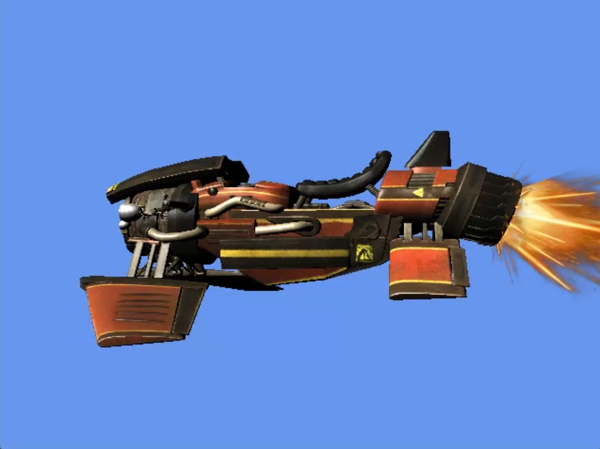
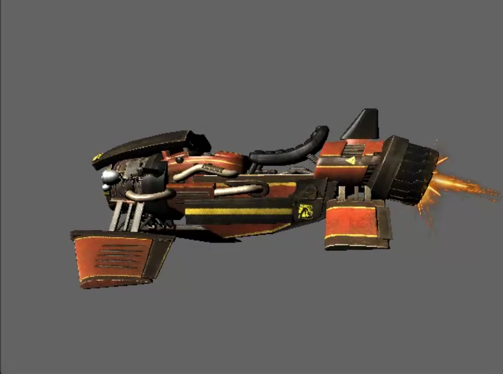

# Dual Rasterizer Project

A dual-mode 3D rasterizer supporting both hardware-accelerated (DirectX 11) and software-based (CPU) rendering. Developed by Ivans Minajevs (2GD11), this project demonstrates core computer graphics concepts including vertex transformation, rasterization algorithms, shading techniques, texture mapping, depth buffering, and camera systems.

---

## Overview

The Dual Rasterizer Project offers a flexible 3D rendering framework that can switch between:

* **Hardware Rendering**: Leveraging the DirectX 11 GPU pipeline for accelerated rendering.
  

* **Software Rendering**: A custom CPU-based rasterizer illustrating the fundamentals of graphics pipelines.
  

Switch between modes at runtime to compare performance and visual output, and explore various shading, texturing, and debugging visualizations.

---

## Key Features

* **Rendering Modes**

  * Hardware (DirectX 11)
  * Software (Custom CPU rasterizer)
* **Shading Techniques**

  * Combined (Diffuse + Specular)
  * Observed Area (Ambient Occlusion)
  * Diffuse only
  * Specular only
* **Texture Mapping** with UV interpolation and normal mapping support
* **Depth Buffering** with clear visualization mode
* **Bounding Box Visualization** for debugging
* **Transparent Fire Effect** with alpha blending
* **Camera System** with configurable view and projection matrices
* **Culling Modes**: Back, Front, None
* **Sampler States** (Hardware only): Point, Linear, Anisotropic
* **Uniform Clear Colors** toggle
* **FPS Counter** display

---

## Interactive Controls

| Key | Function                                                      | Mode     |
| --- | ------------------------------------------------------------- | -------- |
| F1  | Toggle Rasterizer Mode (HARDWARE/SOFTWARE)                    | Shared   |
| F2  | Toggle Vehicle Rotation                                       | Shared   |
| F3  | Toggle FireFX                                                 | Shared   |
| F4  | Cycle Sampler State (POINT/LINEAR/ANISOTROPIC)                | Hardware |
| F5  | Cycle Shading Mode (COMBINED/OBSERVED\_AREA/DIFFUSE/SPECULAR) | Software |
| F6  | Toggle NormalMap                                              | Software |
| F7  | Toggle DepthBuffer Visualization                              | Software |
| F8  | Toggle BoundingBox Visualization                              | Software |
| F9  | Cycle CullMode (BACK/FRONT/NONE)                              | Shared   |
| F10 | Toggle Uniform ClearColor                                     | Shared   |
| F11 | Toggle Print FPS                                              | Shared   |

---

## Technical Details

### Software Rasterizer

* **Vertex Transformation**: Implements a custom vertex shader equivalent on the CPU.
* **Triangle Rasterization**: Utilizes barycentric coordinate-based filling.
* **Depth Buffering**: Z-buffer implementation with per-pixel depth testing.
* **Shading Models**:

  * Combined (Diffuse + Specular)
  * Observed Area (Ambient Occlusion)
  * Diffuse only
  * Specular only
* **Texture Mapping**: UV coordinate interpolation and sampling.
* **Normal Mapping**: Enhances surface detail with normal maps.
* **Visualization**: Bounding boxes and depth buffer display for debugging.

### Hardware Renderer

* **DirectX 11 Setup**: Device, swap chain, render target, and depth stencil configuration.
* **Shaders**: HLSL vertex and pixel shaders for vertex transformation and fragment shading.
* **Sampler States**: Point, linear, and anisotropic filtering modes.
* **Depth Stencil**: Configuration for depth testing and writing.
* **Render Targets**: Back buffer and optional render-to-texture for effects.

## Dependencies

* **DirectX 11 SDK** (included with Windows SDK)
* **GLM** for mathematics (header-only)
* **STB Image** for texture loading
* **Win32 API** for window and input handling

